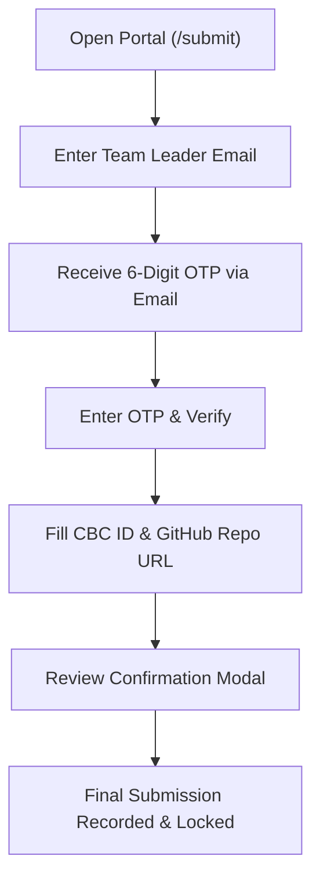

# CBC 2.0 // Project Submission Portal User Guide

This guide provides step-by-step instructions for participants and team leaders on how to use the **Code Breaker Challenge (CBC 2.0)** Project Submission Portal.

---

## 📌 1. Portal Overview

* **Portal URL:** `https://cbc-2-xv2u.vercel.app/submit` (or click **SUBMISSION** in the top navigation bar).
* **Who Submits:** The **Team Leader** (using their registered email ID).
* **What is Submitted:**
  1. **CBC ID** (e.g. `CBC049`)
  2. **GitHub Repository URL** (e.g. `https://github.com/username/project-repo`)

> [!IMPORTANT]
> **One-Time Submission Rule:** Once your team submits the GitHub repository link, the form will be **locked permanently**. Re-submissions or edits cannot be made through the portal. Please ensure your link is correct before confirming.

---

## 🔐 2. Step-by-Step Submission Workflow

---

### Step 1: Login via One-Time Password (OTP)
1. Go to the [**Submission Portal**](https://cbc-2-xv2u.vercel.app/submit).
2. Enter the **Team Leader Email Address** that was used during hackathon registration.
3. Click **Send Verification Code**.
4. Check your email inbox (and spam/junk folder) for a 6-digit OTP code sent by `cbc2.o.tech@gmail.com`.
5. Enter the 6-digit code in the boxes provided and click **Verify & Open Dashboard**.

---

### Step 2: Fill Project Details
Once logged in, you will be taken directly to the **Project Repository Submission** form:

1. **Enter CBC ID:**
   * Enter your assigned team identification code (e.g., `CBC049`, `CBC112`, etc.).
   * The field automatically standardizes your team ID.
2. **Enter GitHub Repository URL:**
   * Enter the full URL to your project's repository.
   * **Valid Format:** `https://github.com/username/repository-name`
   * Ensure the green **✓ Valid format** checkmark appears.

---

### Step 3: Repository Setup & Notice Checklist

> [!WARNING]
> Prior to submitting, please ensure your GitHub repository meets the following evaluation requirements:
> 1. Set your repository visibility to **Public**.
> 2. Grant collaborator access to `cbc2.o.tech@gmail.com` so evaluators and judges can review your commits, code structure, and branches.

---

### Step 4: Final Confirmation & Submission
1. Click **Submit Final Project**.
2. A confirmation modal will pop up displaying your **CBC ID** and **GitHub Repository URL**.
3. Review the details carefully.
4. Click **Confirm & Submit**.
5. Once submitted:
   * A confirmation message will appear: *"Final project repository submission received and locked! ✓"*
   * The form will lock into read-only mode showing **`FINAL SUBMISSION LOCKED`**.
   * Your GitHub repository URL is instantly written to **Column F (`GITHUB`)** of the official jury evaluation sheet.

---

## 📊 3. PPT / Presentation Submission

> [!NOTE]
> Project presentation slides/PDFs are **not uploaded through this portal**. 
> * PPT/PDF files are submitted via the separate official Google Form.
> * Google Drive presentation links submitted in the Google Form are automatically extracted and mapped to your CBC ID in the main evaluation sheet.

---

## 🛠️ 4. Troubleshooting & Support

| Issue | Resolution |
| :--- | :--- |
| **Did not receive OTP email** | Check your **Spam / Junk** folder. Wait 60 seconds and click **Resend Code**. |
| **Invalid GitHub URL error** | Ensure the link starts with `https://github.com/` followed by your username and repository name. |
| **Submitted wrong link / Need reset** | Contact organizers at [`codebreaker.aiml@gmail.com`](mailto:codebreaker.aiml@gmail.com). Organizers can clear your entry in the evaluation sheet to allow a re-submission. |
| **Logged into wrong team** | Click the **Logout** button on the top-right header and log in with your correct team leader email. |

---

## 📞 5. Contact Organizers
For any urgent submission issues during the hackathon:
* **Email:** [`codebreaker.aiml@gmail.com`](mailto:codebreaker.aiml@gmail.com)
* **Technical Lead:** `cbc2.o.tech@gmail.com`
